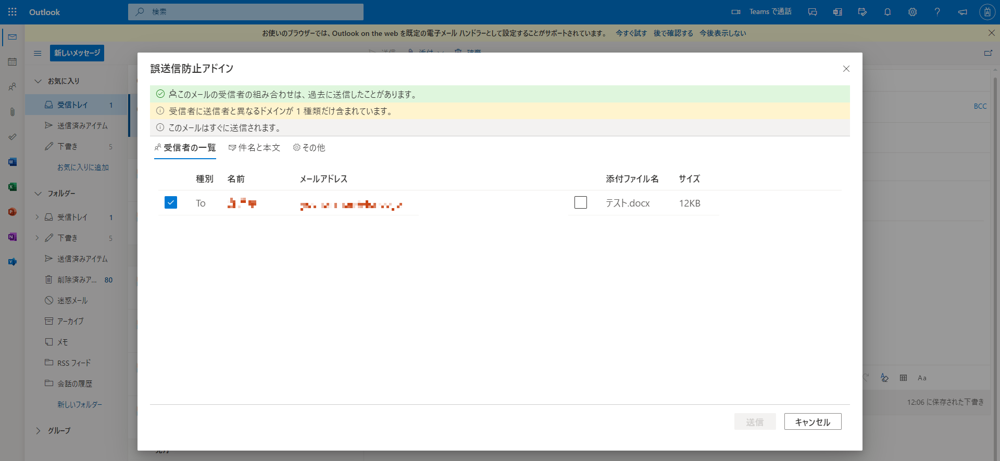
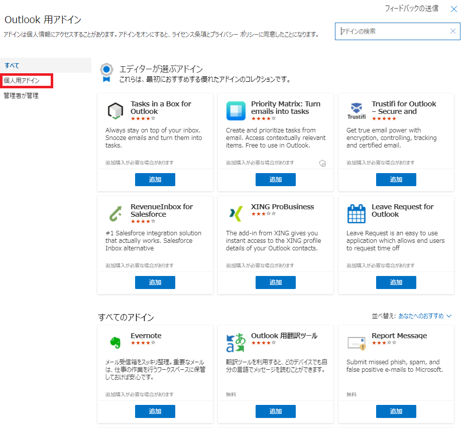
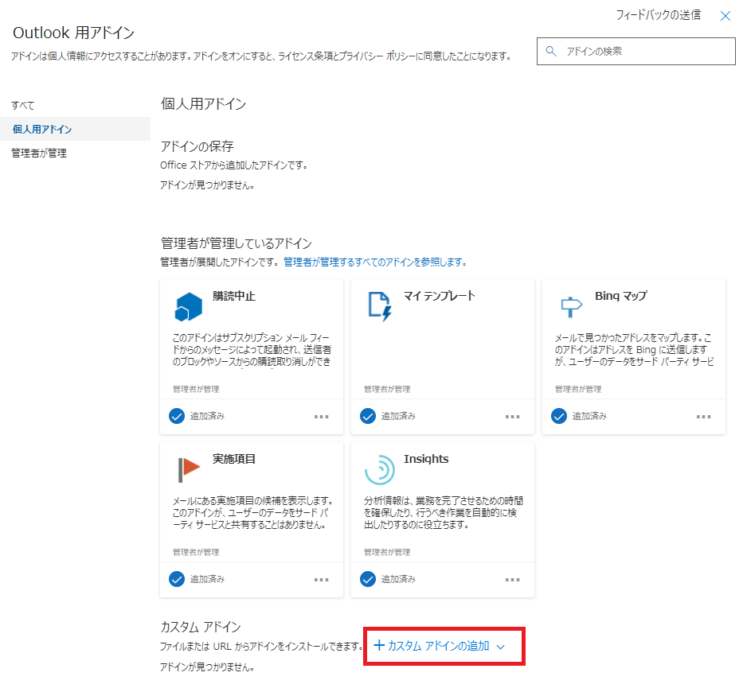
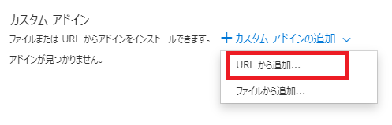
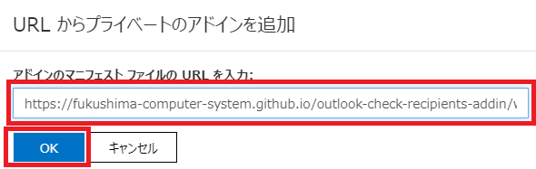
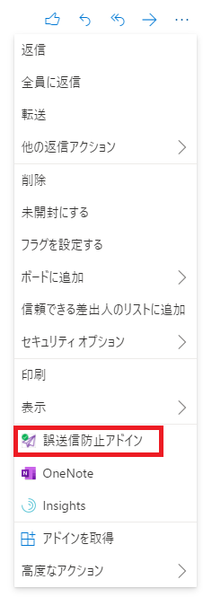

# 誤送信防止アドイン

Microsoft の Outlook で使用できる誤送信防止を目的とするアドインです。

## ライセンス

**本アドインのライセンスは、MIT License です。
権利保有者は「[福島コンピューターシステム株式会社](https://www.fcs.co.jp)」とします。
利用者は、自己の責任において本アドインを利用するものとし、作者は、いかなる保証もしません。**

## 主要な機能

### 宛先・添付ファイル確認

チェックボックスで宛先と添付ファイルをひとつずつ確認できます。

### 遅延送信（Web 版 Outlook のみ）

数分間遅らせて送信することができます。

### 複数ドメイン警告

複数のドメインあてに送信する場合に、二重確認を促します。

### 過去の送信パターン確認

過去に送信したことがあるかどうかを確認することができます。

## 動作環境

- Office Web アドインです。Web 版 / Desktop 版の Outlook 両方で動作します。
- デスクトップ版 : Windows 1910 (build 12130.20272) 以降
- Web 版 : Exchange Online に接続するモダン Outlook UI

## インストール方法

### 個別インストール

Desktop 版の Outlook を起動します。
メニューバーから「ファイル」タブを押下し、「アドインの管理」を押下します。

ブラウザが起動し、Web 版の Outlook にログインします。
アドインを管理するためのダイアログが表示されますので、「個人用アドイン」を選択します。

下部にある「カスタムアドインの追加」を押下します。

「URLから追加」を押下します。

入力欄に「 https://fukushima-computer-system.github.io/outlook-check-recipients-addin/dist/manifest.xml 」と入力し、「OK」を押下します。

警告が表示される場合、「インストール」を押下します。
メールを送信すると、宛先確認ダイアログが表示されます。

### 個人用設定

個人用の設定を行うことができます。
受信トレイの適当なメッセージを選択し、「…」ボタンを押下すると、下記のようなメニューが表示され、個人用設定に遷移することができます。

### M365 管理センターからの一元展開

下記 URL から展開できます。テナントの管理者ログインが必要です。

https://admin.microsoft.com/adminportal/home#/Settings/AddIns

1. 「アドインの展開」＞「次へ」＞「カスタムアプリをアップロード」＞「マニフェストのURLがわかります」を選択します。
2. URL の入力欄に「 https://fukushima-computer-system.github.io/outlook-check-recipients-addin/dist/manifest.xml 」と入力します。
3. 「アップロード」を押下します。
4. 展開方法を選択して、「展開」を押下します。例えば「すべてのユーザー」に対して「固定」で展開すると、テナント内のすべてのユーザーに本アドインが適用され、ユーザーはアドインを削除することができなくなります。

**注意**

> 固定で展開した場合、アドインが何らかの原因で起動できなくなった場合、メールが送信できなくなります。このような問題も含め、作者はいかなる保証もいたしません。リスクを検討したうえでご利用願います。

## 注意事項

- 本アドインを利用するためにはブラウザの設定で「サードパーティのCookieをブロックする」が有効になっている場合は、本アドインはご利用いただけません。
- 本アドインは、動作に必要なスクリプトを配布する以外の目的で、本アドインを作成した者が展開するサーバ（GitHub Pages）に対してメールにかかわるデータ（宛先・件名・本文・添付ファイル等）を送信することはありません。
- 次のメールボックスでは機能しません。
  - 共有メールボックス
  - グループ メールボックス
  - オフライン モード
- 確認ダイアログを表示したまま一定時間（5 分）が経過すると、Outlook によってアドインが正常に終了しなかったと判断され、アドインのスクリプトがアンロードされます。その結果、操作できなくなります。その場合、ページをリロードする必要があります。
- 本アドインはメッセージに対して 2 種類の通知を表示します。Outlook の仕様または他のアドイン等により合計 5 種類より多い通知が蓄積されると、一部の通知は表示されなくなります。
- プライベート配布リストは、展開しなければ送信できません。
- パブリック配布リストは、展開しなくても送信できます。
- To / Cc / Bcc に指定できるのは、それぞれ 100 件までです。
- 遅延送信は、Desktop 版では使用できません。
- 会議アイテムの送信では、本アドインは起動しません。
- 会議アイテムの転送では、本アドインは起動します。
- 会議アイテムに対する承諾では、本アドインは起動しません。

## サードパーティライセンス

